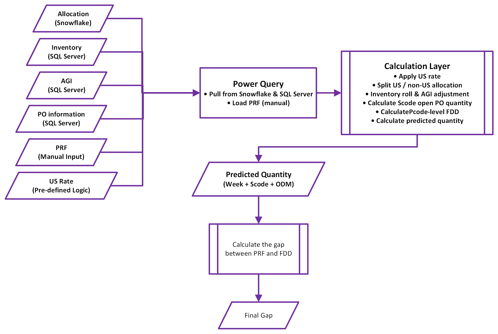
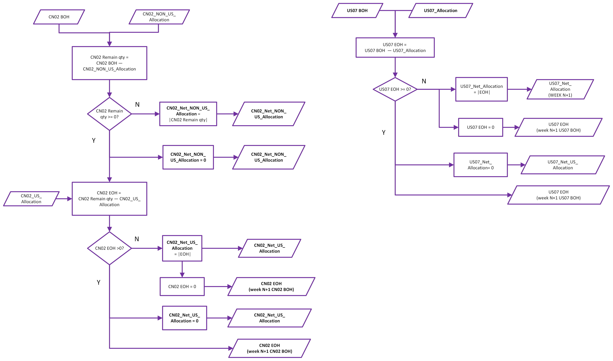
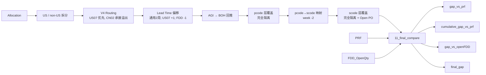

# 📦 Supply Planning Automation Demo

> **Supply‑Demand Alignment & Gap Analysis Framework (SDA Framework)**

一个基于 **Excel / Power Query / SQL / Python** 的作品集项目，展示如何将规则驱动的供应规划逻辑，整理成可维护、可复用、可审计的自动化数据流程。

> [!NOTE]
> **关于本仓库的说明（Honest Disclaimer）**
> 本仓库为个人**作品集演示**，用于展示方法论、数据架构与代码工程能力。
> - ✅ **不包含任何真实业务数据行**、示例数据集、生产环境配置或业务文件
> - ✅ 展示的是**逻辑结构与实现思路**，而非可运行的真实数据管道
> - ⚠️ 为保证代码真实性，SQL / Power Query 中保留了**真实的表名与模块命名**；脱离内网无法访问，也不含任何数据内容

---

## ★ v4 更新（相较 v3 的主要变化）

| 变更点 | 说明 |
|--------|------|
| 🔄 **scode 库存独立取数** | `07_scode_inventory` 改为独立 SQL：合并 `Mchb`（普通成品仓）+ `Mslb`（特殊/寄售库存）UNION ALL，不再依赖 `inventory_raw`；PQ 从 8 步简化为 1 步 |
| 🔄 **AGI 合并取数** | 新增 `05_agi_pcode_level` 独立 SQL，合并原 `04 in-week_AGI` 的取数与透视 |
| 🔄 **pcode 库存独立取数** | `06_pcode_inventory` 独立 SQL，同时按 Plant 与 COO 透视（合并原 `06_pcode_inventory_current_wide`） |
| ➕ **累计口径 Gap** | 新增 `cumulative_gap_vs_prf`（按 scode + odm_desc 逐周 running sum） |
| ➕ **新增字段** | 新增 `ssd_family_name`、`scode_alloc_qty`（US07 week‑3 / CN02 week‑2 偏移） |
| 🔧 **FDD supply 口径** | `gap_vs_openFDD` 的 supply 改为：**首周 = open_po + prf**，**其他周 = prf**（不再全程叠加 Open PO） |
| 🔧 **final_gap 口径** | `final_gap = MIN(cumulative_gap_vs_prf, gap_vs_openFDD)`，取更保守（更负）的缺口 |
| 🔧 **BOH 来源重构** | FDD 视角 BOH：首周取 `07_scode_inventory` 实时 snapshot，其余周在 11 内部滚动，允许负值传递累积 FDD 欠账 |
| 📊 **Gap Dashboard** | 新建 Gap Dashboard 透视表，面向业务快速查看缺口 |

---

## 📌 项目简介

本项目模拟一个典型的 **供应规划场景**：将 Allocation、Inventory、AGI、PRF、FDD、Open PO 等多张输入表整合到统一模型中，通过规则计算生成最终输出。

**核心目标：**
- 估算未来各周的 **production need**（净需求）
- 将模型推导结果分别与 **PRF**（工厂排产计划）和 **FDD**（ODM 供给承诺）进行双层对比
- 输出可操作的 **gap 分析** 与 **final_gap 建议值**

**最终输出粒度：** `week + scode + odm_desc`

---

## 🔁 核心流程（Pipeline）

### 端到端总流程


### Allocation V4 Routing 决策逻辑


### pcode 层滚动库存覆盖




> **主线：** Allocation → US/non-US 拆分 → V4 routing → Lead time 偏移 → AGI rollback → pcode 覆盖 → scode 覆盖 → PRF compare → FDD compare

---

## 🏗️ 数据架构

### 输入层

| 表名 | 说明 |
|------|------|
| `00_control` | 参数控制表 |
| `01_alloc_raw` | Allocation 原始数据（gross demand 起点） |
| `02_us_rate_final` | US rate 最终版本 |
| `MM_US_Rate` | 物料主数据（含 PTI_CONSOLIDATED 标记） |
| `PRF` | 工厂计划 benchmark |
| `FDD_OpenQty` | FDD 供给承诺数据 |

### 计算层

| 表名 | 说明 |
|------|------|
| `03_alloc_pcode_level` | 按 us_rate 拆分 US/non-US，再经 V4 routing 分配 |
| `04_alloc_pcode` | pcode 层聚合；同时作为 scode allocation 来源（US07 week-3、CN02 week-2 偏移） |
| `05_agi_pcode_level` | ★ 独立 SQL，合并原 AGI 取数与透视，输出 us07/cn02_agi_wtd_qty |
| `06_pcode_inventory` | ★ 独立 SQL，按 Plant + COO 透视 |
| `07_scode_inventory` | ★ 独立 SQL，Mchb + Mslb 合并，透视为 pega/pti_scode_inventory_qty |
| `08_pcode_roll` | pcode 层滚动库存覆盖（完全隔离） |
| `09_scode_roll` | scode 层滚动库存覆盖（完全隔离，含 Open PO） |
| `10_prf_long` | PRF 长表 |
| `12_open_po` | Open PO 按 scode + site + week 汇总，pass-due 归入首周 |

### 输出层

| 表名 | 说明 |
|------|------|
| `11_final_compare` | 最终对比输出（含 gap_vs_prf、cumulative_gap_vs_prf、gap_vs_openFDD、final_gap） |
| **Gap Dashboard** | ★ 面向业务的透视表 |

---

## 🔑 核心模块详解

### 1️⃣ Allocation V4 Routing

| 步骤 | 操作 |
|------|------|
| Step 1 | `pcode + demand_group` 粒度：`us_qty = alloc × us_rate`，`non_us_qty = alloc × (1−us_rate)` |
| Step 2 | `week + scode` 聚合：`AMR_Need = Σus_qty`，`NON_AMR_Need = Σnon_us_qty` |
| Step 3 | US07 优先覆盖：`AMR_Need ≤ US07_Alloc → CN02_US_Alloc=0`；否则 `= AMR_Need − US07_Alloc` |
| Step 4 | 非 US 需求全归 CN02：`CN02_NON_US_Alloc = NON_AMR_Need` |

**输出：** `US07_Alloc`、`CN02_US_Alloc`、`CN02_NON_US_Alloc`

> **PTI_CONSOLIDATED override：** 白名单（PTI_CONSOLIDATED / FIPS / AMR，及历史 US 出货占比 >90% 的 pcode/customer）在 US_Rate 表中 us_rate 直接固定为 100%，全局 split 时自动 `us_alloc = total_alloc`，无需单独分支。

### 2️⃣ Lead Time 偏移

| Plant | 通用偏移 | 额外偏移 | 总计 |
|-------|:-------:|:-------:|:----:|
| CN02 | 2 周 | — | **2 周** |
| US07 | 2 周 | +1 周 | **3 周** |

- `09` steps 3-4：US07 self-join 取 week+1（额外 +1）
- `09` step 6：所有 scode gross need week **-2**（通用 pcode→scode）
- `11`：FDD week **-1**（独立比较偏移）
- 首周特殊：`US07_Net_Alloc = week N + week N+1`
- Plant 合并：NL02 → CN02

### 3️⃣ AGI → BOH 回推
```
本周开始时初始库存 = 当前时点库存 + 本周 WTD AGI
```
AGI **不**扣减 demand，仅用于回推 Beginning BOH。数据由 `05_agi_pcode_level` 独立 SQL 提供。

### 4️⃣ pcode 层库存覆盖（完全隔离）

| Demand 来源 | 可消耗库存 | 跨 plant |
|-------------|-----------|:--------:|
| US07 demand（US only） | 只吃 US07（TW pool） | ❌ |
| CN02 demand（US + non-US） | 只吃 CN02（CN pool） | ❌ |

- **US07（单步）：** `end = MAX(0, 可用 − US07_Alloc)`；`net_need = MAX(0, US07_Alloc − 可用)`
- **CN02（两步，Non-US 优先）：**
  - Step 1（先扣 Non-US）：`after_nonus = MAX(0, 可用 − CN02_NON_US_Alloc)`
  - Step 2（剩余扣 US 溢出）：`end = MAX(0, after_nonus − CN02_US_Alloc)`

> ⚠️ 完全隔离，禁止任何跨 plant 补位（旧版单向补位规则已废弃）。

### 5️⃣ pcode → scode 映射（week -2）

| pcode 层输出 | → scode 层 | odm_desc |
|-------------|-----------|----------|
| US07_net_need + CN02_US_net_need | `pti_gross_need_qty` | PTI Taiwan NPSG |
| CN02_NON_US_net_need | `pega_gross_need_qty` | Pegatron NPSG |

### 6️⃣ scode 层库存覆盖（完全隔离 + Open PO）

| 工厂 | ODM | 库存来源 |
|------|-----|---------|
| TW02 | PTI | 独立 SQL（Mchb + Mslb 合并） |
| CN04 | PEGA | 独立 SQL（Mchb + Mslb 合并） |

```
available[w]     = BOH[w] + open_po[w]
end_inventory[w] = MAX(0, available[w] - demand[w])
BOH[w+1]         = end_inventory[w]
```

> **Open PO 定义：** `Open PO Qty = scheduled_quantity − quantity_delivered`（>0 即在途）
> 数据源：`vFact_SapDirect_Eket + Ekpo + Ekko`，筛选 ZNB / FG01 / deletion ≠ L；仅 TW02/CN04。
> Pass-due（week < MinPRFWeek）自动聚合到 MinPRFWeek（动态取自 `10_prf_long`）。

### 7️⃣ 双层 Gap 对比

| 层级 | 公式 |
|------|------|
| PRF（逐周） | `gap_vs_prf = prf_qty − predicted_qty` |
| PRF（累计）★ | `cumulative_gap_vs_prf`（按 scode+odm_desc running sum） |
| FDD | `gap_vs_openFDD = BOH + supply − open_fdd` |

**FDD supply 分周取值（v4）：**

| 周次 | supply |
|------|--------|
| 首周（week = MinPRFWeek） | `open_po + prf_qty` |
| 其他周 | `prf_qty` |

> **FDD 视角 BOH 滚动：** 首周取 `07_scode_inventory` 实时 snapshot；其余周 `next_week_BOH = 本周 gap_vs_openFDD`，**允许负值传递**以累积 FDD 欠账（不做 MAX(0) 下限）。
> `open_fdd = 0` 时**不归零**，由上周 BOH 继续滚动（该值为信息性滚动余额）。

### 8️⃣ Final Gap

```
final_gap = MIN(cumulative_gap_vs_prf, gap_vs_openFDD)
```
取两个 gap 中更小（更负）的值，作为最保守的缺口建议。方向统一：正 = 够，负 = 不够。

---

## 📊 最终输出字段（11_final_compare）

| 列名 | 含义 | 来源 |
|------|------|------|
| `predicted_qty` | 模型推算净需求 | 首列汇总 pass-due net_need + 当周；其他周为单周 |
| `prf_qty` | 工厂排产计划 | PRF 表 |
| `gap_vs_prf` | 逐周缺口 | `prf_qty − predicted_qty` |
| `cumulative_gap_vs_prf` | ★ 累计缺口 | 按 scode+odm_desc running sum |
| `ssd_family_name` | ★ SSD 产品族名 | 10_prf_long merge（无匹配为 null） |
| `scode_alloc_qty` | ★ scode 原始 allocation（扣减前） | 04_alloc_pcode，US07 -3 / CN02 -2 偏移，pass-due 归入 MinPRFWeek |
| `boh` | scode 期初库存 | 首周取 07 snapshot，其余周内部滚动 |
| `open_po` | 在途采购订单 | 12_open_po |
| `open_fdd` | FDD 承诺出货量（week -1） | FDD_OpenQty（偏移后） |
| `gap_vs_openFDD` | 总供给 vs FDD | `BOH + supply − open_fdd` |
| `final_gap` | 最终缺口建议 | `MIN(cumulative_gap_vs_prf, gap_vs_openFDD)` |

**输出粒度：** `week + scode + odm_desc`

---

## 🛠️ 技术栈

| 技术 | 用途 |
|------|------|
| **Excel + Power Query (M)** | 主计算引擎；`List.Accumulate` 实现滚动库存覆盖 |
| **SQL Server** | Allocation / Inventory (Mchb+Mslb) / AGI / Open PO (Eket+Ekpo+Ekko) / FDD 取数 |
| **Python** | 辅助数据预处理与验证 |

---

## 📂 仓库结构

```
excel-planning-automation-demo/
├── README.md
├── docs/
│   └── SDA_Framework_项目阶段总结.md
├── assets/
│   ├── 01_overall_pipeline.png
│   ├── 02_allocation_v4_routing.png
│   └── 03_inventory_roll_logic.png
├── sql/
│   ├── inventory_raw.sql
│   ├── allocation_raw.sql
│   ├── agi_inweek.sql
│   └── fdd_open_po_source.sql
└── power_query/
    ├── 08_pcode_roll.pq        # ⭐ pcode 滚动覆盖 (List.Accumulate)
    ├── 09_scode_roll.pq        # ⭐ scode 滚动覆盖 + Open PO
    ├── 11_compare_vs_prf.pq    # ⭐ 双层 Gap + Final Gap
    └── 12_open_po.pq           # ⭐ Open PO 动态聚合
```

---

## 📋 版本历史

| 版本 | 时间 | 主要变更 |
|------|------|---------|
| **v4** | 2026-05 | ★ scode 库存独立 SQL（Mchb+Mslb）；AGI 合并入 05；06 独立 SQL 按 Plant+COO<br>★ 新增 cumulative_gap_vs_prf / ssd_family_name / scode_alloc_qty<br>★ FDD supply 改为首周 open_po+prf、其他周 prf<br>★ final_gap = MIN(cumulative_gap_vs_prf, gap_vs_openFDD)<br>★ BOH 取 07 snapshot + FDD 视角负值滚动；新增 Gap Dashboard |
| **v3** | 2026-05 | Open PO 在途供给模块；FDD 独立评估；final_gap 综合列；BOH week+1 偏移 |
| **v2** | 2026-04 | V4 routing；AGI 改为 BOH 回推；pcode / scode 完全隔离 |
| **v1** | 2026-03 | 初始框架，基本 Allocation → Inventory → PRF 对比链路 |

---

## ⚠️ 已知边界与关键假设

| 项目 | 说明 |
|------|------|
| AGI 定位 | 仅作周初 BOH 回推依据，不再作为 demand 扣减项 |
| 完全隔离 | pcode 层 US07/CN02、scode 层 PTI/PEGA 均完全隔离，禁止跨 plant 补位 |
| Lead time | pcode→scode 通用 2 周 + US07 额外 1 周；FDD 独立 -1 周；如变化需同步改这两处 |
| PTI 路由 | PTI_CONSOLIDATED = 100% 的 scode 全部路由到 PTI |
| FDD 维度 | FDD 仅在 pcode 层评估；BOH 允许负值向下传递累积欠账（不做 MAX(0)） |
| Open PO 范围 | 基于 Item delivery date 分周，实际到货可能偏移；仅覆盖 TW02/CN04 的 LA |
| scode 库存 | 合并 Mchb + Mslb 的 unrestricted 总量；若寄售库存有使用限制，可能略高估可用量 |
| 刷新性能 | 完整刷新较慢，主要瓶颈是数据库服务器位于美国的网络延迟；中间 query 已设为 Connection Only |

---

## 🚀 后续可优化方向

- [ ] 区分 **Committed / Open FDD**（AB > 0 vs AB = 0）
- [ ] **Effective Supply** 指标：`min(prf_qty, FDD_OpenQty)`
- [ ] **Bottleneck Flag**：标记瓶颈在 PRF 侧还是 FDD 侧
- [ ] Open PO 交期偏差追踪与置信区间
- [ ] 寄售库存使用限制的区分处理

---

## 📄 License / Disclaimer

This repository is a de-identified portfolio project for demonstration purposes only.
It contains **no real data rows, no confidential business data, and no production configuration**.
Table and module names are retained for structural authenticity only.
