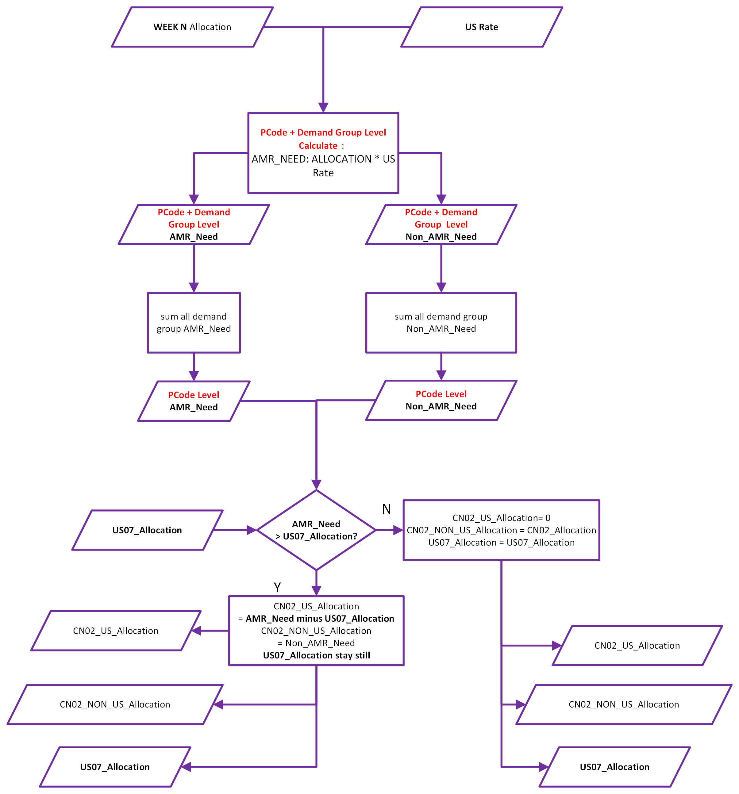
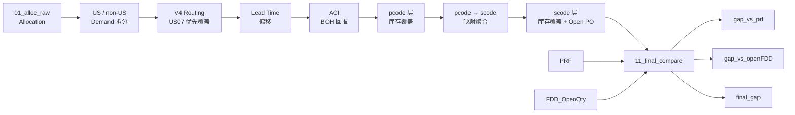

# 📦 Supply Planning Automation Demo

> **Supply‑Demand Alignment & Gap Analysis Framework (SDA Framework)**

一个基于 **Excel / Power Query / SQL / Python** 的脱敏作品集项目，展示如何将规则驱动的供应规划逻辑整理成可维护、可复用、可审计的自动化数据流程。

> [!WARNING]
> 本仓库为个人作品集演示版本。
> 所有数据、字段名、业务实体、编码和规则均已做脱敏、抽象或简化处理，仅用于展示方法论与实现思路。

---

## 📌 项目简介

本项目模拟了一个典型的 **供应规划场景**：

将多张输入表（需求 Allocation、库存 Inventory、AGI、PRF、FDD、Open PO）整合到统一模型中，通过规则计算生成最终输出，用于业务复核和报表展示。

**核心目标：**
- 估算未来各周的 **production need**（净需求）
- 将模型推导结果分别与 **PRF**（工厂排产计划）和 **FDD**（ODM 供给承诺）进行双层对比
- 输出可操作的 **gap 分析** 与 **final_gap 建议值**

---

## 🔁 核心流程（Pipeline）

### 端到端总流程


### Allocation V4 Routing 决策逻辑


### pcode 层滚动库存覆盖




**一句话总结：**

以 Allocation 为 gross demand 起点 → 按 `us_rate` 拆分 US / non-US → V4 routing 决定 US07 / CN02 分配 → Lead time 使 US07 前移一周 → AGI 回推 BOH → pcode 层完全隔离覆盖 → scode 层 BOH + Open PO 完全隔离覆盖 → 双层 gap 对比 → final_gap 综合建议。

---

## 🏗️ 数据架构

整个表结构体现了 **「输入层 → 计算层 → 输出层」** 的清晰分层：

### 输入层

| 表名 | 说明 |
|------|------|
| `00_control` | 参数控制表（当前周、分析起始周等） |
| `01_alloc_raw` | Allocation 原始数据（gross demand 起点） |
| `02_us_rate_final` | US rate 最终版本 |
| `MM_US_Rate` | 物料主数据（含 PTI_CONSOLIDATED 标记） |
| `PRF` | 工厂排产计划（benchmark） |
| `04 in-week_AGI` | 当周 AGI 数据 |
| `inventory_raw` | 统一库存源表（pcode & scode 共用） |
| `FDD_OpenQty` | FDD 供给承诺数据 |

### 计算层

| 表名 | 说明 |
|------|------|
| `03_alloc_pcode_level` | US / non-US 拆分（pcode + demand_group 粒度） |
| `04_alloc_pcode` | pcode 层聚合（week + pcode + scode） |
| `05_agi_pcode_wide` | AGI pcode 宽表 |
| `06_pcode_inventory_current_wide` | pcode 当前库存宽表 |
| `07_pcode_boh_base` | pcode BOH 基准（当前库存 + AGI 回推） |
| `08_pcode_roll` | pcode 层滚动库存覆盖（US07 / CN02 完全隔离） |
| `09_scode_roll` | scode 层滚动库存覆盖（PTI / PEGA 完全隔离，含 Open PO） |
| `10_prf_long` | PRF 长表 |
| `12_open_po` | Open PO 按 scode + site + week 汇总 |

### 输出层

| 表名 | 说明 |
|------|------|
| `11_final_compare` | 最终对比输出（含 `gap_vs_prf`、`gap_vs_openFDD`、`final_gap`） |

---

## 🔑 核心模块详解

### 1️⃣ Allocation V4 Routing

> US07 优先覆盖 US demand，溢出由 CN02 承接。

| 步骤 | 操作 |
|------|------|
| Step 1 | 在 `pcode + demand_group` 粒度按 `us_rate` 拆分 `us_qty` / `non_us_qty` |
| Step 2 | 在 `week + scode` 层聚合 `AMR_Need` 和 `NON_AMR_Need` |
| Step 3 | US07 优先覆盖：若 `AMR_Need ≤ US07_Alloc` → CN02 不承接；否则溢出到 CN02 |
| Step 4 | 非 US 需求全部归 CN02 |

**输出三个量：** `US07_Alloc`、`CN02_US_Alloc`、`CN02_NON_US_Alloc`

### 2️⃣ Lead Time 偏移

| Plant | 规则 | 原因 |
|-------|------|------|
| CN02 | 取 week N | 本地运输，无需提前 |
| US07 | 取 week N+1 | 运输周期较长，需提前一周发运 |

**首周特殊处理：** `US07_Net_Alloc = week N + week N+1`（当前周已在进行中，需同时完成本周发货和下周备货）

### 3️⃣ AGI → BOH 回推

```
本周开始时初始库存 = 当前时点库存 + 本周 WTD AGI
```

AGI 不再用于扣减 demand，仅用于从当前库存回推出 **Beginning BOH**。

### 4️⃣ pcode 层库存覆盖（完全隔离）

| Demand 来源 | 可消耗库存 | 能否跨 plant |
|-------------|-----------|:----------:|
| US07 的所有 demand（US only） | 只吃 US07 库存 | ❌ |
| CN02 的所有 demand（US + non-US） | 只吃 CN02 库存 | ❌ |

库存不足时直接穿透为 net need，**不允许跨 plant 补位**。

**滚动公式：**
```
end_inventory = MAX(0, 可用库存 - demand)
net_need      = MAX(0, demand - 可用库存)
可用库存      = 同一 pcode 上一行的 end_inventory；若为新 pcode 则取 begin_BOH
```

### 5️⃣ scode 层库存覆盖（完全隔离 + Open PO）

| 工厂 | 对应 ODM | 规则 |
|------|---------|------|
| TW02 | PTI | 只吃 PTI scode inventory + PTI Open PO |
| CN04 | PEGA | 只吃 PEGA scode inventory + PEGA Open PO |

**覆盖公式（含 Open PO 增强）：**
```
available[w]     = BOH[w] + open_po[w]
end_inventory[w] = MAX(0, available[w] - demand[w])
net_need[w]      = MAX(0, demand[w] - available[w])
BOH[w+1]         = end_inventory[w]
```

> **Open PO 定义：** `Open PO Qty = Quantity (PO) - SUM(Quantity Reduced (MRP))`
> 差值 > 0 即为尚未到货的在途供给。早于 PRF 首周的 Open PO 自动聚合到首周，不会丢失。

### 6️⃣ 双层 Gap 对比

| 层级 | 公式 | 回答的问题 |
|------|------|-----------|
| 第一层 | `gap_vs_prf = prf_qty − predicted_qty` | 工厂计划能否覆盖模型需求？ |
| 第二层 | `gap_vs_openFDD = BOH + prf_qty + open_po − open_fdd` | 该周总供给能否覆盖 FDD 承诺出货量？ |

> **方向统一：正 = 够，负 = 不够。**

FDD 时间偏移：FDD 原始数据的 week 整体 **-1** 后再与主表 join，对齐 scode 提前一周备货的 lead time。

### 7️⃣ Final Gap 综合建议

| 场景 | `final_gap` 取值 |
|------|-----------------|
| 两个 gap 都 < 0 | 取绝对值更大的那个（最大缺口） |
| 仅 FDD gap < 0 | 以 FDD gap 为准 |
| 仅 PRF gap < 0 | 以 PRF gap 为准 |
| 两个 gap 都 ≥ 0 | 不显示（供给充足） |
| 无 FDD 数据 | 回退到 PRF gap |

---

## 📊 最终输出字段（11_final_compare）

| 列名 | 含义 | 来源 |
|------|------|------|
| `predicted_qty` | 模型推算的净需求 | scode 层库存覆盖后穿透量 |
| `prf_qty` | 工厂排产计划 | PRF 表 |
| `gap_vs_prf` | 模型 vs 工厂计划 | `prf_qty − predicted_qty` |
| `BOH` | 该周 scode 期初库存 | 09_scode_roll（滚动后 end_inventory + week+1 偏移） |
| `open_po` | 该周在途采购订单 | 12_open_po → 09_scode_roll |
| `open_fdd` | FDD 承诺出货量（已 week-1 偏移） | FDD_OpenQty |
| `gap_vs_openFDD` | 总供给 vs FDD 承诺 | `BOH + prf_qty + open_po − open_fdd` |
| `final_gap` | 综合缺口建议值 | 综合 gap_vs_prf 与 gap_vs_openFDD |

**输出粒度：** `week + scode + odm_desc`

---

## 🛠️ 技术栈

| 技术 | 用途 |
|------|------|
| **Excel + Power Query (M)** | 主计算引擎；含 `List.Accumulate` 实现滚动库存覆盖 |
| **SQL Server** | Open PO / FDD 数据提取（CTE + 窗口函数去重） |
| **Python** | 辅助数据预处理与验证 |
| **Snowflake** | 上游原始数据源（通过 Power Query 连接刷新） |

---

## 📂 文件说明

| 文件 | 说明 |
|------|------|
| `README.md` | 项目概览（本文件） |
| `SDA_Framework_项目阶段总结.docx` | 完整项目文档（v3，含公式、SQL、业务口径详述） |

---

## 📋 版本历史

| 版本 | 时间 | 主要变更 |
|------|------|---------|
| **v3** | 2026-05 | ✅ 新增 Open PO 在途供给模块<br/>✅ FDD 独立评估路径（BOH + PRF + Open PO − FDD）<br/>✅ final_gap 综合建议列<br/>✅ BOH week+1 偏移与下限保护<br/>✅ open_fdd=0 时输出空字符串区分无承诺 |
| **v2** | 2026-04 | V4 routing（US07 优先覆盖 + CN02 承接溢出）<br/>AGI 改为 BOH 回推<br/>pcode / scode 完全隔离规则<br/>US rate 白名单 + 小样本平滑 |
| **v1** | 2026-03 | 初始框架搭建，基本 Allocation → Inventory → PRF 对比链路 |

---

## ⚠️ 已知边界与关键假设

| 项目 | 说明 |
|------|------|
| AGI 近似 | 本周内库存变化仅考虑 AGI，其他 movement 暂不纳入 |
| 完全隔离 | pcode 层 US07/CN02 不跨 plant 补位；scode 层 PTI/PEGA 不互相 cover |
| FDD 时间错位 | FDD 一般安排在 ≤3 周内，模型 predicted_qty 在前三周可能为 0 |
| Open PO 交期偏差 | 基于 Item delivery date (PO)，实际到货可能偏移 |
| Open PO 范围 | 当前仅覆盖 TW02/CN04 的 LA 记录 |
| PTI_CONSOLIDATED | us_rate 已在上游设为 100%，全局 split 自动处理，无需单独分支 |

---

## 🚀 后续可优化方向

- [ ] 区分 **Committed / Open FDD**：标记 AB > 0 和 AB = 0，评估供给确定性
- [ ] **Effective Supply** 指标：`effective_supply = min(prf_qty, FDD_OpenQty)`，识别 binding constraint
- [ ] **Bottleneck Flag**：自动标记当前瓶颈在 PRF 侧还是 FDD 侧
- [ ] **Open PO 交期偏差追踪**：基于历史数据评估 Open PO 预测精度
- [ ] **交期可靠性评估**：为 gap 增加置信区间

---

## 📄 License

本项目仅用于个人作品集展示，不包含任何真实业务数据。
