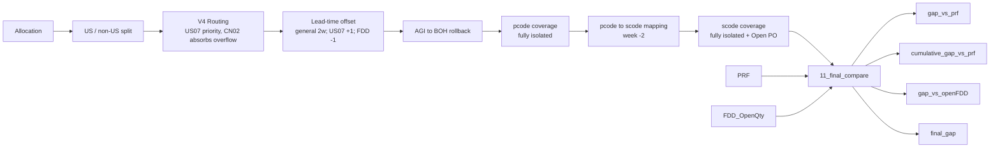

# 📦 Supply Planning Automation Demo

> **Supply-Demand Alignment & Gap Analysis Framework (SDA Framework)**

> 🌐 **Language:** English | [中文](README_CN.md)

A portfolio project built on **Excel / Power Query / SQL / Python**, demonstrating how rule-driven supply-planning logic can be turned into a maintainable, reusable, and auditable automated data pipeline.

> [!NOTE]
> **Honest Disclaimer**
> This repository is a personal **portfolio demo** intended to showcase methodology, data architecture, and data-engineering capability.
> - ✅ Contains **no real business data rows**, sample datasets, production configuration, or business files
> - ✅ Demonstrates **logic and implementation approach**, not a runnable production pipeline
> - ⚠️ For code authenticity, the SQL / Power Query retain **real table and module names**; these are inaccessible outside the corporate network and carry no data content


## 📌 Project Overview

This project models a typical **supply-planning scenario**: it integrates multiple input tables (Allocation, Inventory, AGI, PRF, FDD, Open PO) into a unified model and applies rule-based calculations to produce the final output.

**Core goals:**
- Estimate weekly future **production need** (net demand)
- Compare the model's projections against **PRF** (factory production plan) and **FDD** (ODM supply commitment) in two independent layers
- Produce actionable **gap analysis** and a **final_gap** recommendation

**Output grain:** `week + scode + odm_desc`

---

## 🔁 Core Pipeline

The framework is documented at two levels of detail: an **L1** top-level overview and a fully decomposed **L2** flow with six sub-processes.

### L1 — Top-level overview

assets/L1_overview.png

### L2 — End-to-end pipeline

assets/L2.0_overall_pipeline.png

<details>
<summary><b>L2 sub-processes (click to expand)</b></summary>

<br>

#### L2.1 — Allocation COO split (V4 routing)

assets/L2.1_allocation_coo_split.png

#### L2.2 — P-code starting inventory and rolling

assets/L2.2_pcode_inventory_rolling.png

#### L2.3 — S-code starting inventory and rolling

assets/L2.3_scode_inventory_rolling.png

#### L2.4 — Gap vs PRF

assets/L2.4_gap_vs_prf.png

#### L2.5 — Gap vs Open FDD

assets/L2.5_gap_vs_openfdd.png

#### L2.6 — Final Gap

assets/L2.6_final_gap.png

</details>



> **Main line:** Allocation → US/non-US split → V4 routing → lead-time offset → AGI rollback → pcode coverage → scode coverage → PRF compare → FDD compare

---

## 🏗️ Data Architecture

### Input Layer

| Table | Description |
|-------|-------------|
| `00_control` | Parameter control table |
| `01_alloc_raw` | Raw allocation data (gross-demand starting point) |
| `02_us_rate_final` | Final US-rate version |
| `MM_US_Rate` | Material master (includes PTI_CONSOLIDATED flag) |
| `PRF` | Factory-plan benchmark |
| `FDD_OpenQty` | FDD supply-commitment data |

### Computation Layer

| Table | Description |
|-------|-------------|
| `03_alloc_pcode_level` | Splits US/non-US by us_rate, then allocates via V4 routing |
| `04_alloc_pcode` | pcode-level aggregation; also feeds scode allocation (US07 week-3, CN02 week-2 offsets) |
| `05_agi_pcode_level` | ★ Dedicated SQL merging former AGI extraction and pivot; outputs us07/cn02_agi_wtd_qty |
| `06_pcode_inventory` | ★ Dedicated SQL, pivoting by Plant + COO |
| `07_scode_inventory` | ★ Dedicated SQL, UNIONs Mchb + Mslb, pivoted to pega/pti_scode_inventory_qty |
| `08_pcode_roll` | pcode-level rolling inventory coverage (fully isolated) |
| `09_scode_roll` | scode-level rolling inventory coverage (fully isolated, incl. Open PO) |
| `10_prf_long` | PRF long table |
| `12_open_po` | Open PO aggregated by scode + site + week; pass-due rolled into first week |

### Output Layer

| Table | Description |
|-------|-------------|
| `11_final_compare` | Final comparison output (gap_vs_prf, cumulative_gap_vs_prf, gap_vs_openFDD, final_gap) |
| **Gap Dashboard** | ★ Business-facing pivot table |

---

## 🔑 Core Modules

### 1️⃣ Allocation V4 Routing

| Step | Operation |
|------|-----------|
| Step 1 | At `pcode + demand_group` grain: `us_qty = alloc × us_rate`, `non_us_qty = alloc × (1−us_rate)` |
| Step 2 | Aggregate at `week + scode`: `AMR_Need = Σus_qty`, `NON_AMR_Need = Σnon_us_qty` |
| Step 3 | US07 covers US demand first: `AMR_Need ≤ US07_Alloc → CN02_US_Alloc=0`; otherwise `= AMR_Need − US07_Alloc` |
| Step 4 | All non-US demand goes to CN02: `CN02_NON_US_Alloc = NON_AMR_Need` |

**Outputs:** `US07_Alloc`, `CN02_US_Alloc`, `CN02_NON_US_Alloc`

> **PTI_CONSOLIDATED override:** For whitelisted items (PTI_CONSOLIDATED / FIPS / AMR, and any pcode/customer with historical US shipment share > 90%), us_rate is hard-fixed to 100% in the US_Rate table. The global split then automatically yields `us_alloc = total_alloc`, so no separate override branch is needed.

### 2️⃣ Lead-Time Offset

| Plant | General offset | Extra offset | Total |
|-------|:-------------:|:------------:|:-----:|
| CN02 | 2 weeks | — | **2 weeks** |
| US07 | 2 weeks | +1 week | **3 weeks** |

- `09` steps 3-4: US07 self-join takes week+1 (the extra +1)
- `09` step 6: all scode gross need shifted week **-2** (general pcode→scode)
- `11`: FDD shifted week **-1** (independent comparison offset)
- First-week special case: `US07_Net_Alloc = week N + week N+1`
- Plant merge: NL02 → CN02

### 3️⃣ AGI → BOH Rollback
```
beginning-of-week inventory = current inventory + this-week WTD AGI
```
AGI does **not** deduct demand; it is used only to roll current inventory back to the Beginning BOH. Data is supplied by the `05_agi_pcode_level` dedicated SQL.

### 4️⃣ pcode-Level Inventory Coverage (fully isolated)

| Demand source | Consumable inventory | Cross-plant |
|---------------|---------------------|:-----------:|
| US07 demand (US only) | US07 only (TW pool) | ❌ |
| CN02 demand (US + non-US) | CN02 only (CN pool) | ❌ |

- **US07 (single step):** `end = MAX(0, available − US07_Alloc)`; `net_need = MAX(0, US07_Alloc − available)`
- **CN02 (two steps, non-US first):**
  - Step 1 (deduct non-US first): `after_nonus = MAX(0, available − CN02_NON_US_Alloc)`
  - Step 2 (deduct US overflow from remainder): `end = MAX(0, after_nonus − CN02_US_Alloc)`

> ⚠️ Fully isolated — no cross-plant borrowing (the old one-way top-up rule is deprecated).

### 5️⃣ pcode → scode Mapping (week -2)

| pcode-level output | → scode level | odm_desc |
|--------------------|--------------|----------|
| US07_net_need + CN02_US_net_need | `pti_gross_need_qty` | PTI Taiwan NPSG |
| CN02_NON_US_net_need | `pega_gross_need_qty` | Pegatron NPSG |

### 6️⃣ scode-Level Inventory Coverage (fully isolated + Open PO)

| Plant | ODM | Inventory source |
|-------|-----|------------------|
| TW02 | PTI | Dedicated SQL (Mchb + Mslb union) |
| CN04 | PEGA | Dedicated SQL (Mchb + Mslb union) |

```
available[w]     = BOH[w] + open_po[w]
end_inventory[w] = MAX(0, available[w] - demand[w])
BOH[w+1]         = end_inventory[w]
```

> **Open PO definition:** `Open PO Qty = scheduled_quantity − quantity_delivered` (> 0 means in-transit)
> Source: `vFact_SapDirect_Eket + Ekpo + Ekko`, filtered on ZNB / FG01 / deletion ≠ L; TW02/CN04 only.
> Pass-due rows (week < MinPRFWeek) are auto-aggregated into MinPRFWeek (dynamically taken from `10_prf_long`).

### 7️⃣ Dual Gap Comparison

| Layer | Formula |
|-------|---------|
| PRF (per week) | `gap_vs_prf = prf_qty − predicted_qty` |
| PRF (cumulative) ★ | `cumulative_gap_vs_prf` (running sum per scode+odm_desc) |
| FDD | `gap_vs_openFDD = BOH + supply − open_fdd` |

**FDD supply, by week (v4):**

| Week | supply |
|------|--------|
| First week (week = MinPRFWeek) | `open_po + prf_qty` |
| Other weeks | `prf_qty` |

> **FDD-view BOH rolling:** first week uses the `07_scode_inventory` real-time snapshot; for later weeks, `next_week_BOH = this week's gap_vs_openFDD`, **allowing negative carry-over** to accumulate FDD backlog (no MAX(0) floor).
> When `open_fdd = 0`, the value is **not** zeroed — BOH keeps rolling from the previous week (this figure is an informational running balance).

### 8️⃣ Final Gap

```
final_gap = MIN(cumulative_gap_vs_prf, gap_vs_openFDD)
```
Takes the smaller (more negative) of the two gaps as the most conservative shortfall recommendation. Sign convention is unified: positive = sufficient, negative = short.

---

## 📊 Final Output Fields (11_final_compare)

| Column | Meaning | Source |
|--------|---------|--------|
| `predicted_qty` | Model-projected net need | First column sums pass-due net_need + current week; other weeks are single-week |
| `prf_qty` | Factory production plan | PRF table |
| `gap_vs_prf` | Per-week gap | `prf_qty − predicted_qty` |
| `cumulative_gap_vs_prf` | ★ Cumulative gap | Running sum per scode+odm_desc |
| `ssd_family_name` | ★ SSD product-family name | Merged from 10_prf_long (null if no match) |
| `scode_alloc_qty` | ★ scode raw allocation (pre-deduction) | 04_alloc_pcode, US07 -3 / CN02 -2 offsets, pass-due rolled into MinPRFWeek |
| `boh` | scode beginning inventory | First week from 07 snapshot; other weeks rolled internally |
| `open_po` | In-transit purchase orders | 12_open_po |
| `open_fdd` | FDD committed shipment (week -1) | FDD_OpenQty (after offset) |
| `gap_vs_openFDD` | Total supply vs FDD | `BOH + supply − open_fdd` |
| `final_gap` | Final shortfall recommendation | `MIN(cumulative_gap_vs_prf, gap_vs_openFDD)` |

**Output grain:** `week + scode + odm_desc`

---

## 🛠️ Tech Stack

| Technology | Use |
|------------|-----|
| **Excel + Power Query (M)** | Main compute engine; `List.Accumulate` for rolling inventory coverage |
| **SQL Server** | Extraction of Allocation / Inventory (Mchb+Mslb) / AGI / Open PO (Eket+Ekpo+Ekko) / FDD |
| **Python** | Auxiliary data preprocessing and validation |

---

## 📂 Repository Structure

```
excel-planning-automation-demo/
├── README.md                       # Project overview (English, default)
├── README.zh-CN.md                 # Project overview (Chinese)
├── docs/
│   └── SDA_Framework_project_summary.md    # Full business-logic document (v4)
├── assets/
│   ├── L1_overview.png                     # L1 top-level overview
│   ├── L2.0_overall_pipeline.png           # L2 end-to-end pipeline
│   ├── L2.1_allocation_coo_split.png       # L2.1 COO split (V4 routing)
│   ├── L2.2_pcode_inventory_rolling.png    # L2.2 P-code rolling
│   ├── L2.3_scode_inventory_rolling.png    # L2.3 S-code rolling
│   ├── L2.4_gap_vs_prf.png                 # L2.4 Gap vs PRF
│   ├── L2.5_gap_vs_openfdd.png             # L2.5 Gap vs Open FDD
│   └── L2.6_final_gap.png                  # L2.6 Final Gap
├── sql/
│   ├── allocation_raw.sql                  # Allocation + scode->pcode mapping
│   ├── agi_inweek.sql                      # In-week AGI (for BOH rollback)
│   ├── inventory_raw.sql                   # Unified inventory query (pcode + scode)
│   └── fdd_open_po_source.sql              # PO Confirmation latest-snapshot source
└── power_query/
    ├── 08_pcode_roll.pq                    # ⭐ pcode rolling coverage (List.Accumulate)
    ├── 09_scode_roll.pq                    # ⭐ scode rolling coverage + Open PO
    ├── 11_compare_vs_prf.pq                # ⭐ Dual gap + Final Gap (v4)
    └── 12_open_po.pq                       # ⭐ Open PO dynamic aggregation (Eket+Ekpo+Ekko)
```

### File Listing

| Path | Type | Description |
|------|------|-------------|
| `sql/allocation_raw.sql` | SQL | Raw allocation (gross demand) + BOM-based scode→pcode mapping |
| `sql/agi_inweek.sql` | SQL | In-week Actual Goods Issue, used to roll back Beginning BOH |
| `sql/inventory_raw.sql` | SQL | Unified inventory extraction (pcode & scode branches) |
| `sql/fdd_open_po_source.sql` | SQL | Latest PO Confirmation snapshot (shared FDD reference) |
| `power_query/08_pcode_roll.pq` | Power Query (M) | pcode-level rolling coverage via `List.Accumulate` (US07/CN02 isolated) |
| `power_query/09_scode_roll.pq` | Power Query (M) | scode-level rolling coverage + Open PO join (PTI/PEGA isolated) |
| `power_query/11_compare_vs_prf.pq` | Power Query (M) | Final output: dual-gap, cumulative gap, FDD-view rolling, final_gap |
| `power_query/12_open_po.pq` | Power Query (M) | Open PO in-transit supply (Eket+Ekpo+Ekko), pass-due aggregation |

> Note: The v4 scode-inventory (Mchb+Mslb) and consolidated AGI/pcode-inventory queries are embedded directly in Power Query for demo simplicity; only the standalone SQL modules are exported here.

---

## 📋 Version History

| Version | Date | Key changes |
|---------|------|-------------|
| **v4** | 2026-05 | ★ scode inventory dedicated SQL (Mchb+Mslb); AGI merged into 05; 06 dedicated SQL by Plant+COO<br>★ Added cumulative_gap_vs_prf / ssd_family_name / scode_alloc_qty<br>★ FDD supply changed to first-week open_po+prf, other weeks prf<br>★ final_gap = MIN(cumulative_gap_vs_prf, gap_vs_openFDD)<br>★ BOH from 07 snapshot + FDD-view negative rolling; new Gap Dashboard |
| **v3** | 2026-05 | Open PO in-transit module; independent FDD evaluation; final_gap column; BOH week+1 offset |
| **v2** | 2026-04 | V4 routing; AGI switched to BOH rollback; pcode / scode full isolation |
| **v1** | 2026-03 | Initial framework; basic Allocation → Inventory → PRF comparison chain |

---

## ⚠️ Known Boundaries & Assumptions

| Item | Description |
|------|-------------|
| AGI role | Used only for beginning-of-week BOH rollback, no longer as a demand deduction |
| Full isolation | pcode US07/CN02 and scode PTI/PEGA are fully isolated; no cross-plant borrowing |
| Lead time | pcode→scode general 2 weeks + US07 extra 1 week; FDD independent -1 week; update both spots if lead time changes |
| PTI routing | scodes with PTI_CONSOLIDATED = 100% route entirely to PTI |
| FDD dimension | FDD is evaluated at the pcode layer only; BOH may carry negative values downstream to accumulate backlog (no MAX(0)) |
| Open PO scope | Bucketed by item delivery date, so actual arrival may drift; covers TW02/CN04 LA records only |
| scode inventory | Merges Mchb + Mslb unrestricted totals; if consignment stock has usage restrictions, available may be slightly overstated |
| Refresh performance | Full refresh is slow, mainly due to network latency to the US-hosted database; intermediate queries are set to Connection Only |

---

## 🚀 Future Directions

- [ ] Distinguish **Committed vs Open FDD** (AB > 0 vs AB = 0)
- [ ] **Effective Supply** metric: `min(prf_qty, FDD_OpenQty)`
- [ ] **Bottleneck flag**: mark whether the constraint is on the PRF or FDD side
- [ ] Open PO delivery-drift tracking with confidence intervals
- [ ] Differentiated handling of consignment-stock usage restrictions

---

## 📄 License / Disclaimer

This repository is a de-identified portfolio project for demonstration purposes only.
It contains **no real data rows, no confidential business data, and no production configuration**.
Table and module names are retained for structural authenticity only.
